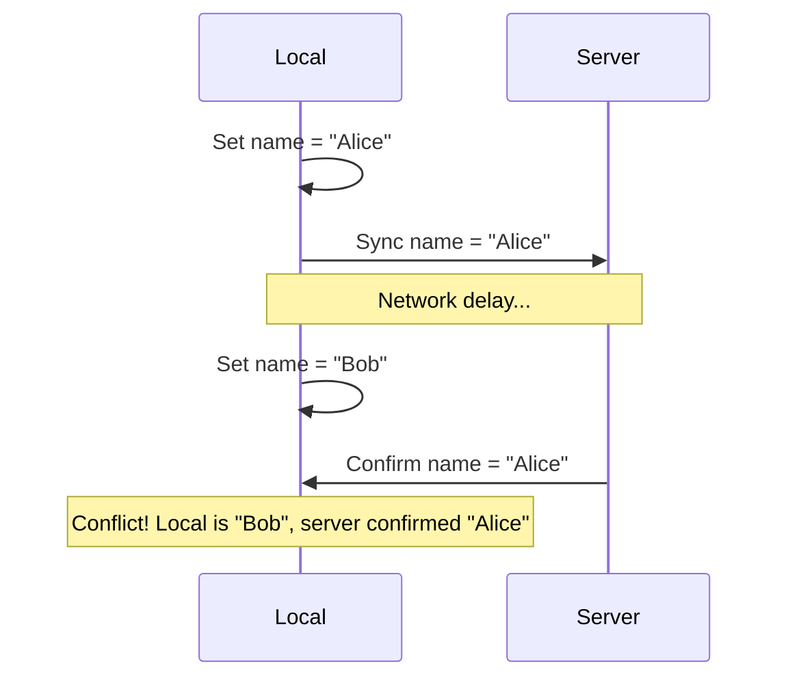

When building local-first applications, conflicts can occur when local and remote data diverge. Legend-State provides several strategies and tools to handle these conflicts gracefully.

## Understanding Conflicts

Conflicts arise in these scenarios:

1. **Concurrent Edits**: Multiple users edit the same data simultaneously
2. **Offline Changes**: User makes changes offline, server state changes meanwhile
3. **Failed Syncs**: Local changes fail to sync, remote state advances
4. **Delayed Responses**: Slow network causes response to arrive after new changes



## Built-in Conflict Prevention

Legend-State includes several mechanisms to prevent conflicts:

### Pending Changes Tracking

The sync system tracks which changes haven't been confirmed by the server:

```ts
import { syncState } from '@legendapp/state'

const data$ = observable(synced({
  persist: { name: 'data', retrySync: true },
  set: async ({ value }) => saveToServer(value)
}))

const state$ = syncState(data$)

// Check for pending changes
const pending = state$.getPendingChanges()
// { "users/123/name": { p: "Alice", v: "Bob", t: ["object"] } }
//   p: previous value (what server has)
//   v: new value (what we're trying to save)
//   t: path types
```

### Generation Tracking

Changes are tracked with generation numbers to prevent stale updates:

```ts
const user$ = observable(synced({
  set: async ({ value }) => {
    // Even if this takes 5 seconds, it won't overwrite
    // newer changes made during that time
    await saveToServer(value)
  }
}))

// User makes rapid changes
user$.name.set('Alice') // Generation 1 starts syncing
user$.name.set('Bob')   // Generation 2 starts syncing
user$.name.set('Carol') // Generation 3 starts syncing

// When generation 1 completes, it won't overwrite Carol
```

### Optimistic UI with Rollback

Changes apply immediately but can be reverted on error:

```ts
const data$ = observable(synced({
  set: async ({ value }) => saveToServer(value),
  onError: (error, { revert }) => {
    if (error.message === 'Conflict') {
      // Revert local changes
      revert()
      // Show conflict message
      alert('Your changes conflicted with server changes')
    }
  }
}))
```

## Conflict Resolution Strategies

### Strategy 1: Last Write Wins

Simplest strategy - most recent change wins:

```ts
const data$ = observable(synced({
  mode: 'set', // Replace entire value
  get: async () => fetchFromServer(),
  set: async ({ value }) => saveToServer(value)
}))

// Local change always overwrites server
data$.set({ name: 'Local Value' })
```

**Pros**: Simple, no conflict handling needed
**Cons**: Can lose data if conflicts occur
**Best for**: Settings, preferences, single-user data

### Strategy 2: Server Wins

Server state always takes precedence:

```ts
const data$ = observable(synced({
  get: async () => fetchFromServer(),
  set: async ({ value, update }) => {
    try {
      const serverValue = await saveToServer(value)
      // Always use server response
      update({ value: serverValue, mode: 'set' })
    } catch (error) {
      // On conflict, fetch latest from server
      const latest = await fetchFromServer()
      update({ value: latest, mode: 'set' })
    }
  }
}))
```

**Pros**: Guaranteed consistency with server
**Cons**: Can lose local changes
**Best for**: Read-heavy data, authoritative server

### Strategy 3: Client Wins (Retry)

Keep retrying until local changes succeed:

```ts
const data$ = observable(synced({
  persist: { name: 'data', retrySync: true },
  retry: {
    infinite: true,
    backoff: 'exponential'
  },
  set: async ({ value }) => saveToServer(value)
}))
```

**Pros**: Ensures local changes eventually sync
**Cons**: Can cause conflicts if server state changes
**Best for**: Offline-first apps, append-only data

### Strategy 4: Deep Merge

Merge local and remote changes:

```ts
const data$ = observable(synced({
  mode: 'merge', // Deep merge
  get: async () => fetchFromServer(),
  set: async ({ value, update }) => {
    try {
      const saved = await saveToServer(value)
      // Merge server response with local state
      update({ value: saved, mode: 'merge' })
    } catch (error) {
      // On conflict, merge with latest server state
      const latest = await fetchFromServer()
      update({ value: latest, mode: 'merge' })
    }
  }
}))
```

**Pros**: Preserves both local and remote changes
**Cons**: Can create unexpected merged states
**Best for**: Nested objects with independent fields

### Strategy 5: Manual Resolution

Let user decide how to resolve conflicts:

```ts
const data$ = observable(synced({
  set: async ({ value, update }) => {
    try {
      await saveToServer(value)
    } catch (error) {
      if (error.status === 409) { // Conflict
        const serverValue = error.serverValue
        const localValue = value
        
        // Show conflict UI
        const resolved = await showConflictDialog({
          local: localValue,
          remote: serverValue
        })
        
        // Save resolved value
        await saveToServer(resolved)
        update({ value: resolved })
      }
    }
  }
}))
```

**Pros**: User has full control
**Cons**: Requires user interaction
**Best for**: Critical data, document editing

### Strategy 6: Operational Transformation

Transform operations to work on any state:

```ts
const text$ = observable(synced({
  set: async ({ changes }) => {
    // Transform changes into operations
    const operations = changes.map(change => ({
      type: 'insert',
      position: change.path[0],
      value: change.valueAtPath
    }))
    
    // Send operations to server
    await syncOperations(operations)
  }
}))
```

**Pros**: Supports true collaborative editing
**Cons**: Complex to implement
**Best for**: Real-time collaboration, text editors

## Handling Specific Conflict Scenarios

### Scenario: Concurrent Field Updates

Different users edit different fields:

```ts
const user$ = observable(synced({
  mode: 'merge', // Merge changes
  updatePartial: true, // Only send changed fields
  
  set: async ({ value, update }) => {
    const saved = await saveUser(value)
    // Server returns full user with all fields
    // Merge preserves any local changes to other fields
    update({ value: saved, mode: 'merge' })
  }
}))

// User A changes name
user$.name.set('Alice')

// User B changes email (happens concurrently)
// Both changes are preserved via merge
```

### Scenario: Array Conflicts

Handling conflicts in lists:

```ts
const items$ = observable(syncedCrud({
  as: 'array',
  list: async () => fetchItems(),
  
  // Use object/Map instead for better conflict handling
  // Arrays are more prone to position-based conflicts
  fieldId: 'id'
}))

// Better: Use object shape
const itemsObj$ = observable(syncedCrud({
  as: 'object', // Keyed by ID
  list: async () => fetchItems(),
  fieldId: 'id'
}))

// Now each item can be updated independently
itemsObj$['item-1'].name.set('Updated')
```

### Scenario: Delete Conflicts

Handling deleted items:

```ts
const items$ = observable(syncedCrud({
  fieldDeleted: 'isDeleted', // Soft delete
  
  delete: async (item) => {
    // Mark as deleted instead of removing
    await updateItem({ id: item.id, isDeleted: true })
  }
}))

// If user edits while another deletes, soft delete wins
// Can show "This was deleted" message
```

### Scenario: Offline Divergence

User is offline for extended period:

```ts
const data$ = observable(synced({
  changesSince: 'last-sync',
  fieldUpdatedAt: 'updatedAt',
  
  onBeforeGet: ({ value, lastSync, clearPendingChanges }) => {
    // Check if too much time has passed
    const dayInMs = 24 * 60 * 60 * 1000
    if (lastSync && Date.now() - lastSync > dayInMs) {
      // Clear pending changes and re-sync fully
      console.log('Been offline too long, re-syncing from scratch')
      clearPendingChanges()
    }
  }
}))
```

## Preventing Conflicts

### Use Incremental Sync

Only sync changes, not full state:

```ts
const data$ = observable(syncedCrud({
  updatePartial: true, // Only send changed fields
  changesSince: 'last-sync', // Only fetch new changes
  fieldUpdatedAt: 'updatedAt'
}))
```

### Debounce Rapid Changes

Batch rapid edits into single sync:

```ts
const data$ = observable(synced({
  debounceSet: 500, // Wait 500ms after last change
  set: async ({ value }) => saveToServer(value)
}))

// These 3 changes result in 1 sync
data$.field1.set('a')
data$.field2.set('b')
data$.field3.set('c')
```

### Use Timestamps

Let server detect conflicts via timestamps:

```ts
interface Item {
  id: string
  value: string
  updatedAt: number
}

const items$ = observable(syncedCrud<Item>({
  fieldUpdatedAt: 'updatedAt',
  
  update: async (item) => {
    // Server checks if updatedAt matches
    const response = await fetch(`/api/items/${item.id}`, {
      method: 'PUT',
      body: JSON.stringify(item)
    })
    
    if (response.status === 409) {
      throw new Error('Conflict: Item was modified')
    }
    
    return response.json()
  },
  
  onError: (error, { revert }) => {
    if (error.message.includes('Conflict')) {
      // Handle conflict
      revert() // Or merge, or show UI
    }
  }
}))
```

### Use Version Numbers (Optimistic Locking)

```ts
interface Item {
  id: string
  value: string
  version: number
}

const items$ = observable(syncedCrud<Item>({
  update: async (item) => {
    // Server checks version matches
    const response = await fetch(`/api/items/${item.id}`, {
      method: 'PUT',
      headers: { 'If-Match': item.version.toString() },
      body: JSON.stringify(item)
    })
    
    if (response.status === 412) { // Precondition failed
      throw new Error('Version mismatch')
    }
    
    const updated = await response.json()
    // Server incremented version
    return updated
  }
}))
```

## Monitoring Conflicts

### Track Sync Errors

```ts
const errors$ = observable<Error[]>([])

const data$ = observable(synced({
  set: async ({ value }) => saveToServer(value),
  onError: (error, params) => {
    errors$.set(prev => [...prev, error])
    console.log('Sync error:', error.message)
    console.log('Retry attempt:', params.retry.retryNum)
  }
}))

// Display errors to user
observe(() => {
  const errors = errors$.get()
  if (errors.length > 0) {
    showErrorNotification(`${errors.length} sync errors`)
  }
})
```

### Monitor Pending Changes

```ts
const data$ = observable(synced({
  persist: { name: 'data', retrySync: true }
}))

const state$ = syncState(data$)

// Show pending indicator
observe(() => {
  const numPending = state$.numPendingSets.get()
  if (numPending > 0) {
    showSyncIndicator(`${numPending} changes pending`)
  }
})
```

### Check Sync State

```ts
const state$ = syncState(data$)

// Is data in sync?
const isInSync = computed(() => {
  return (
    state$.isLoaded.get() && // Initial load done
    !state$.isSetting.get() && // Not currently syncing
    state$.numPendingSets.get() === 0 && // No pending changes
    !state$.error.get() // No errors
  )
})

observe(() => {
  if (isInSync.get()) {
    showSuccessIndicator('All changes saved')
  }
})
```

## Advanced Patterns

### Custom Conflict Resolution

```ts
function resolveConflict<T>(local: T, remote: T, strategy: 'local' | 'remote' | 'merge'): T {
  switch (strategy) {
    case 'local':
      return local
    case 'remote':
      return remote
    case 'merge':
      return { ...remote, ...local }
  }
}

const data$ = observable(synced({
  set: async ({ value, update }) => {
    try {
      await saveToServer(value)
    } catch (error) {
      if (error.status === 409) {
        const resolved = resolveConflict(
          value,
          error.serverValue,
          'merge'
        )
        await saveToServer(resolved)
        update({ value: resolved })
      }
    }
  }
}))
```

### Conflict-Free Replicated Data Types (CRDTs)

```ts
// Example: Last-Write-Wins Register
interface LWWValue<T> {
  value: T
  timestamp: number
  nodeId: string
}

function mergeLWW<T>(local: LWWValue<T>, remote: LWWValue<T>): LWWValue<T> {
  if (local.timestamp > remote.timestamp) return local
  if (local.timestamp < remote.timestamp) return remote
  // Tie-break with node ID
  return local.nodeId > remote.nodeId ? local : remote
}

const data$ = observable(synced({
  transform: {
    save: (value: T): LWWValue<T> => ({
      value,
      timestamp: Date.now(),
      nodeId: clientId
    }),
    load: (lww: LWWValue<T>): T => lww.value
  },
  set: async ({ value, update }) => {
    const saved = await saveToServer(value)
    // Always merge with CRDT rules
    const current = data$.peek()
    const merged = mergeLWW(current, saved)
    update({ value: merged })
  }
}))
```

### Three-Way Merge

```ts
function threeWayMerge<T extends object>(
  base: T,    // Common ancestor
  local: T,   // Local changes
  remote: T   // Remote changes
): T {
  const result = { ...base }
  
  for (const key in local) {
    const baseVal = base[key]
    const localVal = local[key]
    const remoteVal = remote[key]
    
    if (localVal === remoteVal) {
      result[key] = localVal
    } else if (localVal === baseVal) {
      result[key] = remoteVal // Remote changed
    } else if (remoteVal === baseVal) {
      result[key] = localVal // Local changed
    } else {
      // Both changed - conflict!
      result[key] = localVal // Prefer local
    }
  }
  
  return result
}

const data$ = observable(synced({
  set: async ({ value, update }) => {
    const base = await getBaseVersion()
    const remote = await fetchFromServer()
    const merged = threeWayMerge(base, value, remote)
    await saveToServer(merged)
    update({ value: merged })
  }
}))
```

## Best Practices

<AccordionGroup>
  <Accordion title="Always enable retrySync for critical data">
    ```ts
    const critical$ = observable(synced({
      persist: {
        name: 'critical',
        retrySync: true // Persist pending changes
      },
      retry: { infinite: true }
    }))
    ```
  </Accordion>
  
  <Accordion title="Use timestamps for conflict detection">
    ```ts
    const data$ = observable(syncedCrud({
      fieldUpdatedAt: 'updatedAt',
      changesSince: 'last-sync'
    }))
    ```
  </Accordion>
  
  <Accordion title="Prefer object/Map over arrays">
    ```ts
    // Good - ID-based, conflicts are per-item
    const items$ = syncedCrud({ as: 'object' })
    
    // Risky - position-based, conflicts affect entire array
    const itemsArray$ = syncedCrud({ as: 'array' })
    ```
  </Accordion>
  
  <Accordion title="Handle errors gracefully">
    ```ts
    const data$ = observable(synced({
      onError: (error, { revert, retry }) => {
        if (isRecoverable(error)) {
          // Let retry handle it
        } else {
          // Revert changes
          revert()
          // Notify user
          notifyUser('Changes could not be saved')
        }
      }
    }))
    ```
  </Accordion>
  
  <Accordion title="Use soft deletes for critical data">
    ```ts
    const data$ = observable(syncedCrud({
      fieldDeleted: 'deletedAt',
      // Items are marked deleted, not removed
      // Can be recovered if needed
    }))
    ```
  </Accordion>
</AccordionGroup>

## See Also

- [synced() Function](/sync/synced) - Create synced observables
- [syncState](/api/sync-state) - Monitor sync status
- [Remote Sync](/sync/remote-sync) - Sync plugins
- [Error Handling](/guides/error-handling) - Handle sync errors
