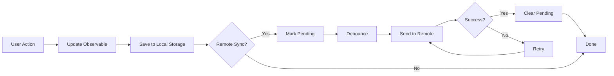

Legend-State provides a comprehensive sync and persistence system designed for **local-first applications**. It enables you to build apps that work offline, sync with remote backends, and provide a seamless user experience with optimistic updates and automatic conflict resolution.

## Why Local-First?

Legend-State's sync system is built on local-first principles:

- **Optimistic Updates**: Changes are applied locally first, making your app feel instant
- **Offline Support**: Apps continue working without a network connection
- **Automatic Retry**: Failed syncs are automatically retried, even after app restart
- **Minimal Diffs**: Only changed data is synced, reducing bandwidth usage
- **Conflict Resolution**: Built-in strategies for handling sync conflicts

<Info>
Legend-State powers the sync systems in production apps like [Legend](https://legendapp.com) and [Bravely](https://bravely.io), making it battle-tested for real-world applications.
</Info>

## Core Concepts

### Local Persistence

Local persistence saves your observable state to device storage automatically:

```ts
import { observable } from '@legendapp/state'
import { synced } from '@legendapp/state/sync'
import { ObservablePersistLocalStorage } from '@legendapp/state/persist-plugins/local-storage'

const settings$ = observable(synced({
  persist: {
    name: 'settings',
    plugin: ObservablePersistLocalStorage
  },
  initial: { theme: 'dark', fontSize: 14 }
}))

// Changes are automatically saved to localStorage
settings$.theme.set('light')
```

### Remote Sync

Remote sync connects your local state to a backend service:

```ts
import { syncedKeel } from '@legendapp/state/sync-plugins/keel'

const users$ = observable(syncedKeel({
  list: queries.getUsers,
  create: mutations.createUser,
  update: mutations.updateUser,
  delete: mutations.deleteUser,
  persist: { name: 'users', retrySync: true },
  changesSince: 'last-sync'
}))

// Changes sync to remote automatically
users$['user-123'].name.set('Alice')
```

## System Architecture

<Steps>
  <Step title="Local Change">
    User modifies data, change is applied immediately to the observable
  </Step>
  <Step title="Persist Locally">
    Change is saved to local storage (IndexedDB, localStorage, MMKV, etc.)
  </Step>
  <Step title="Mark as Pending">
    If remote sync is configured, change is marked as pending in metadata
  </Step>
  <Step title="Sync to Remote">
    Change is sent to the remote backend after a debounce period
  </Step>
  <Step title="Handle Response">
    Remote response is merged back, pending status is cleared
  </Step>
  <Step title="Retry on Failure">
    If sync fails, automatic retry with exponential backoff
  </Step>
</Steps>

## Sync Flow



## Available Persistence Plugins

Legend-State includes plugins for various storage backends:

| Plugin | Platform | Use Case |
|--------|----------|----------|
| `ObservablePersistLocalStorage` | Web | Browser localStorage |
| `ObservablePersistIndexedDB` | Web | Large datasets, structured data |
| `ObservablePersistSessionStorage` | Web | Session-only data |
| `ObservablePersistMMKV` | React Native | Fast, encrypted storage |
| `ObservablePersistAsyncStorage` | React Native | Async key-value store |
| `ObservablePersistExpoSQLite` | Expo | SQLite database |

## Available Sync Plugins

Sync plugins connect to popular backend services:

| Plugin | Backend | Features |
|--------|---------|----------|
| `syncedKeel` | [Keel](https://keel.so) | Full CRUD, auth, realtime |
| `syncedSupabase` | [Supabase](https://supabase.com) | PostgreSQL, realtime subscriptions |
| `syncedFirebase` | Firebase | Realtime Database |
| `syncedCrud` | Custom | Generic CRUD operations |
| `syncedFetch` | Any REST API | Simple fetch-based sync |
| `syncedTanstack` | TanStack Query | React Query integration |

## Key Features

### Automatic Persistence

Changes are automatically saved to local storage without any manual intervention:

```ts
const state$ = observable(synced({
  persist: { name: 'myState', plugin: ObservablePersistLocalStorage },
  initial: { count: 0 }
}))

// Automatically saved to localStorage
state$.count.set(42)
```

### Pending Changes Tracking

Legend-State tracks which changes haven't synced yet:

```ts
const syncState$ = syncState(state$)

// Check if there are pending changes
syncState$.numPendingSets.get() // number of pending operations
syncState$.isSetting.get() // true if currently syncing
```

### Retry with Backoff

Failed syncs are automatically retried with configurable strategies:

```ts
const state$ = observable(synced({
  persist: { name: 'data', retrySync: true },
  retry: {
    infinite: true, // Never give up
    delay: 1000, // Start with 1 second
    backoff: 'exponential', // Double delay each retry
    maxDelay: 30000 // Cap at 30 seconds
  }
}))
```

### Debounced Sync

Batch multiple rapid changes into a single sync operation:

```ts
const state$ = observable(synced({
  debounceSet: 500, // Wait 500ms after last change
  set: async ({ changes }) => {
    // This is called once for batched changes
  }
}))

// These three changes result in one sync call
state$.name.set('Alice')
state$.age.set(30)
state$.email.set('alice@example.com')
```

### Transform Data

Transform data between local and remote formats:

```ts
const state$ = observable(synced({
  transform: {
    load: (value) => {
      // Transform from remote format to local
      return { ...value, loadedAt: Date.now() }
    },
    save: (value) => {
      // Transform from local format to remote
      const { loadedAt, ...rest } = value
      return rest
    }
  }
}))
```

## Sync State

Every synced observable has an associated sync state that tracks its status:

```ts
import { syncState } from '@legendapp/state'

const data$ = observable(synced({ /* ... */ }))
const state$ = syncState(data$)

// Monitor sync status
state$.isLoaded.get() // Has initial load completed?
state$.isSetting.get() // Currently syncing changes?
state$.isPersistLoaded.get() // Has local cache loaded?
state$.numPendingSets.get() // How many pending sync operations?
state$.lastSync.get() // Timestamp of last successful sync
state$.error.get() // Last error, if any
```

### Sync State Methods

```ts
// Manually trigger a sync
await state$.sync()

// Clear local cache
await state$.resetPersistence()

// Get pending changes
const pending = state$.getPendingChanges()
```

## Configuration

### Global Configuration

Set defaults for all synced observables:

```ts
import { configureObservableSync } from '@legendapp/state/sync'
import { ObservablePersistLocalStorage } from '@legendapp/state/persist-plugins/local-storage'

configureObservableSync({
  persist: {
    plugin: ObservablePersistLocalStorage
  },
  retry: {
    infinite: true,
    delay: 1000,
    backoff: 'exponential'
  },
  debounceSet: 500
})
```

### Per-Observable Configuration

Override global defaults for specific observables:

```ts
const data$ = observable(synced({
  persist: { name: 'special-data' },
  retry: { times: 3 }, // Override global retry
  debounceSet: 1000 // Override global debounce
}))
```

## Best Practices

<Warning>
**Always use unique persist names**: Each synced observable should have a unique `persist.name` to avoid data conflicts.
</Warning>

<Note>
**Enable retrySync for critical data**: Set `persist.retrySync: true` to ensure changes eventually sync even after app restarts.
</Note>

### Recommended Setup

```ts
const userData$ = observable(synced({
  // Unique name for this data
  persist: {
    name: 'userData',
    plugin: ObservablePersistLocalStorage,
    retrySync: true // Persist pending changes
  },
  
  // Initial data while loading
  initial: { name: '', email: '' },
  
  // Retry failed syncs indefinitely
  retry: {
    infinite: true,
    backoff: 'exponential'
  },
  
  // Batch rapid changes
  debounceSet: 500,
  
  // Only sync changes since last sync
  changesSince: 'last-sync'
}))
```

## Next Steps

<CardGroup cols={2}>
  <Card title="synced() Function" icon="link" href="/sync/synced">
    Learn how to create synced observables
  </Card>
  <Card title="Local Persistence" icon="database" href="/sync/local-persistence">
    Configure local storage plugins
  </Card>
  <Card title="Remote Sync" icon="cloud" href="/sync/remote-sync">
    Connect to backend services
  </Card>
  <Card title="Conflict Resolution" icon="code-merge" href="/sync/conflict-resolution">
    Handle sync conflicts
  </Card>
</CardGroup>
